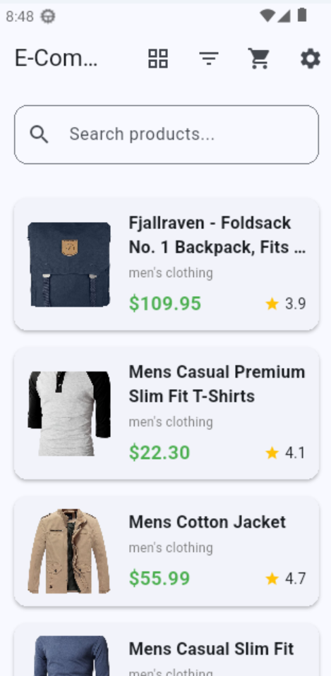
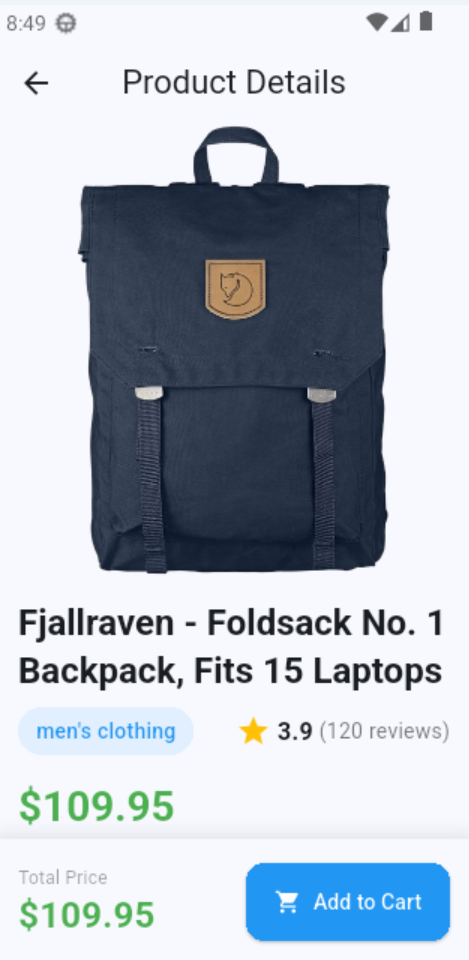
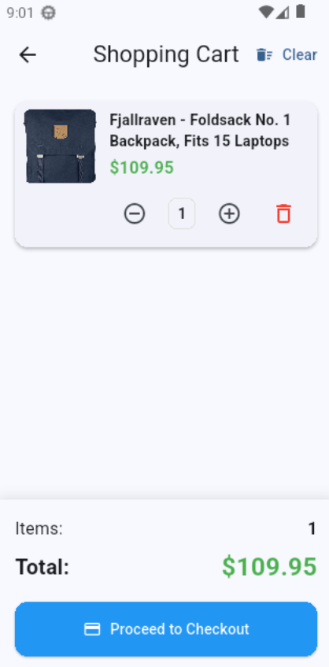
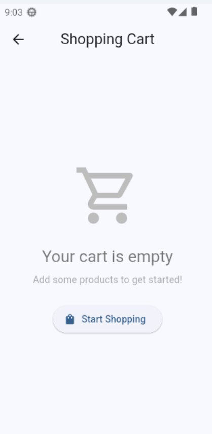
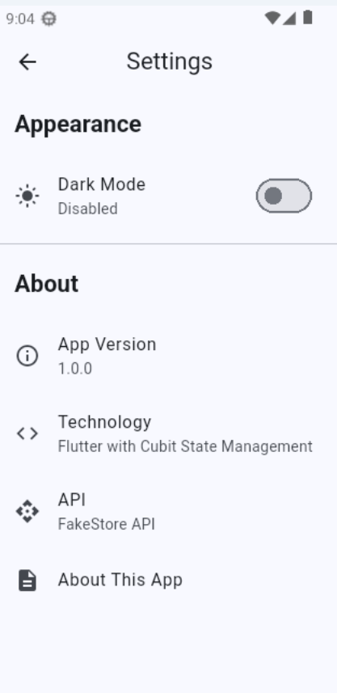
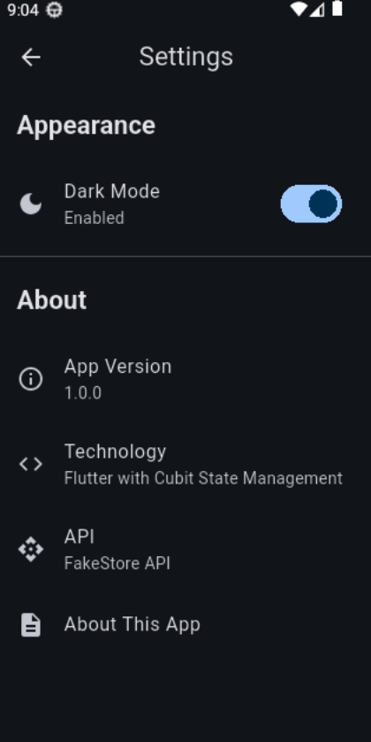
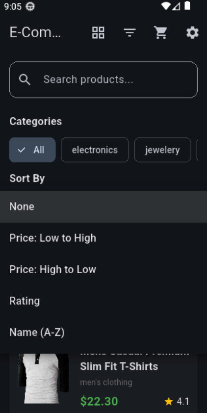
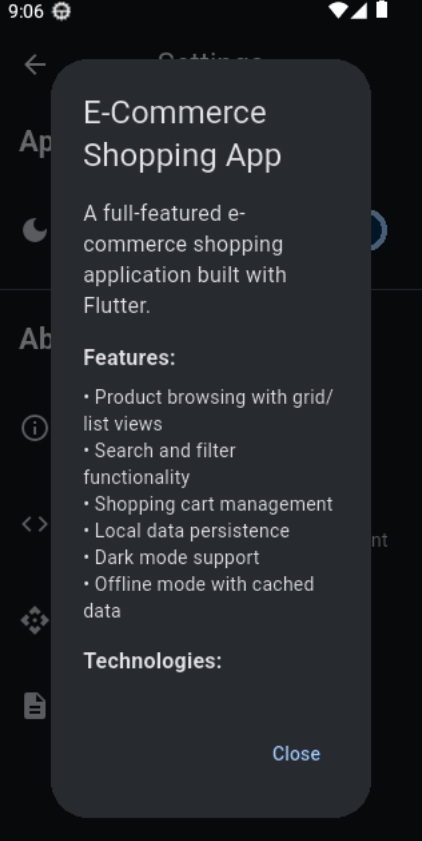

# E-Commerce Shopping App

A Flutter shopping app with product browsing, cart management, and offline support.

## Features

### Product Browsing
- Grid and list view
- Search products
- Filter by category
- Sort by price, rating, or name
- Pull to refresh

### Shopping Cart
- Add/remove items
- Adjust quantities
- Persistent storage
- Total price calculation

### Additional
- Dark mode
- Offline mode with cached data
- Settings screen

## Installation

```bash
cd ecommerce_app
flutter pub get
flutter run
```

## Project Structure

```
lib/
├── main.dart
├── models/
│   ├── product.dart
│   └── cart_item.dart
├── services/
│   ├── api_service.dart
│   └── cache_service.dart
├── cubits/
│   ├── product/
│   ├── cart/
│   └── theme/
└── screens/
    ├── home/
    ├── detail/
    ├── cart/
    └── settings/
```

## Technologies

- Flutter 3.0.0+
- flutter_bloc 8.1.3 (Cubit state management)
- http 1.1.0 (API requests)
- shared_preferences 2.2.2 (Local storage)
- cached_network_image 3.3.0 (Image caching)

## API

Uses FakeStore API: https://fakestoreapi.com

Endpoints:
- GET /products - All products
- GET /products/{id} - Single product

## State Management

### ProductCubit
- loadProducts()
- searchProducts(query)
- filterByCategory(category)
- sortProducts(option)
- toggleViewMode()

### CartCubit
- addItem(...)
- removeItem(id)
- updateQuantity(id, quantity)
- clearCart()

### ThemeCubit
- toggleTheme()
- setDarkMode(bool)

## Screenshots

### Home Screen - Grid View

- Product grid layout

### Home Screen - List View

- Product list layout

### Product Detail

- Full product image
- Description
- Ratings
- Quantity selector
- Add to cart button

### Shopping Cart

- Cart items list
- Quantity controls
- Total price
- Remove items

### Empty Cart

- Empty state message
- Start shopping button

### Settings

- Dark mode toggle
- App information

### Dark Mode

- All screens support dark theme

### Search & Filter

- Search results
- Active filters
- Sort options

### About App
![Offline Mode]


## Implementation Checklist

- [x] Product list (grid/list view)
- [x] Product detail screen
- [x] Shopping cart
- [x] Search functionality
- [x] Category filters
- [x] Sort options
- [x] Cart persistence
- [x] Dark mode
- [x] Offline support
- [x] Error handling

## Troubleshooting

App won't start:
```bash
flutter clean
flutter pub get
flutter run
```

No internet: App works offline with cached products

